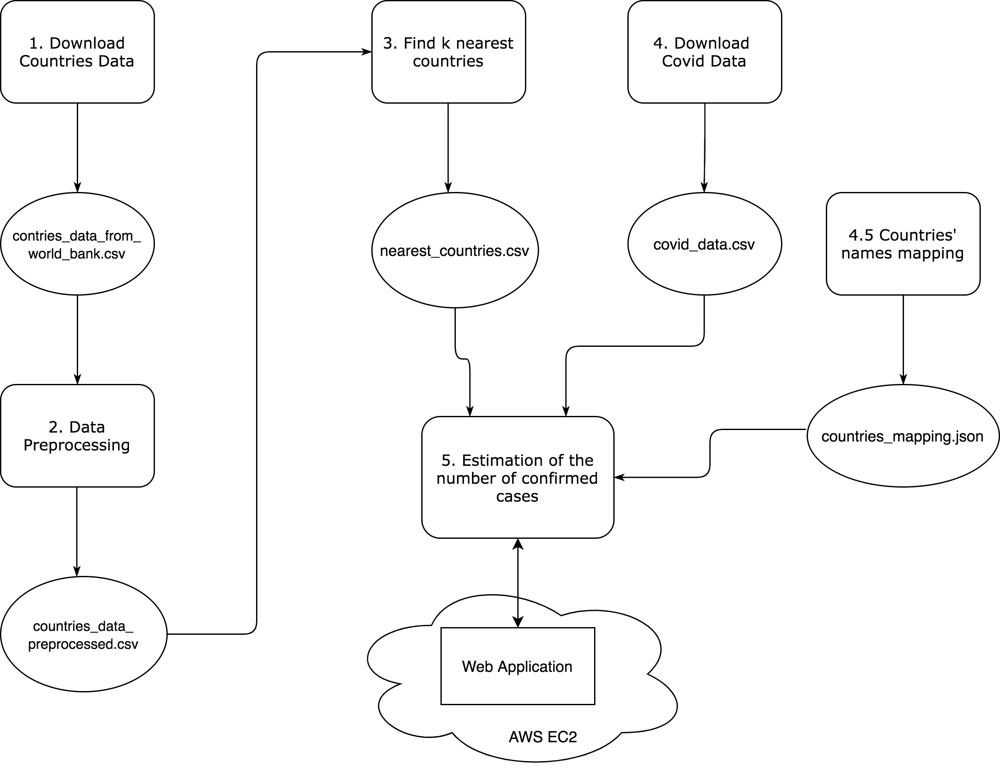

### About this project

The goal is to estimate how many people are infected with COVID-19 in North Korea which doesn’t report its numbers. 
The only coronavirus related information provided for North Korea, is that its first case was on the 1st of March. It should be possible to make an estimation for any successive date. 

Data provided:  [COVID-19 API](https://github.com/pomber/covid19), [World Bank API](https://datahelpdesk.worldbank.org/knowledgebase/articles/898590-country-api-queries)

### Solution

The approach chosen to tackle this problem is to first find the most similar countries to North Korea and then make an estimation of the number of confirmed cases there by aggregating a value based on the numbers of cases of the 'neighbors'.

To implement the solution, a k-Nearest-Neighbors algorithm is used to find the countries, that are 'closest' to North Korea based on the data provided. Once the list of 'neighbors' is generated, the according countries are found in the dataset, providing information about the reported numbers on the Covid-infection. The data is filtered by the date of interest.
The mean of the "neighbors" numbers of confirmed cases is the final estimation for North Korea.

Next, Flask framework is used to implement a web application, taking in an integer representing the number of days since the 1st of Match and showing an estimated number of confirmed cases in North Korea for this date.

The application was deployed on a t3.nano EC2 instance in AWS.

### About this repository

This repository consists of the following notebooks, that correspond to the architecture of the workflow presented below. File limitations.ipybn contains reflections on the limitaions of this project:

- 1_download_countries_data.ipynb
- 2_data_preprocessing.ipynb
- 3_find_knn.ipynb
- 4_download_covid_data.ipynb
- 4_5_countries_mapping.ipynb
- 5_make_an_estimation_of_confirmed_cases.ipynb
- limitations.ipynb

It also contains the Python Web application, that uses the code from the file 5_make_an_estimation_of_confirmed_cases.ipynb:

- rest_api_covid.py

### Architecture 

